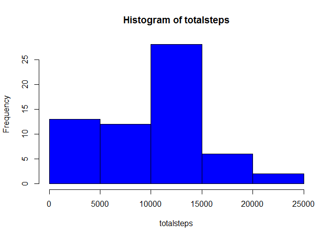
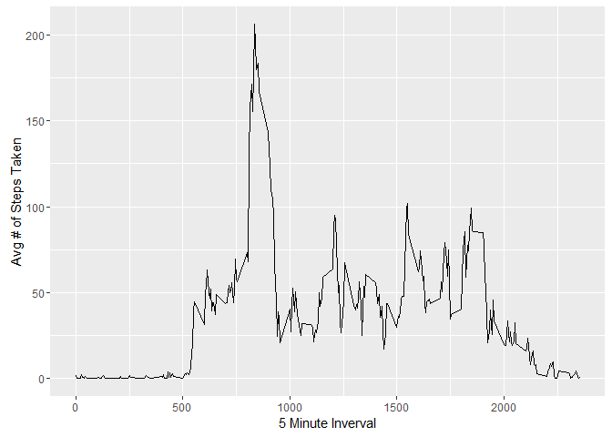
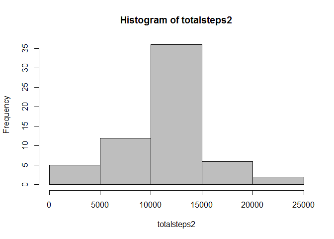

# PA1_template.Rmd
Efthimios Filis  
April 8, 2016  

Loading and preprocessing the data

```r
activity <- read.csv("activity.csv")
```


Calculate the total number of steps taken per day

```r
totalsteps <- tapply(activity$steps, activity$date, FUN=sum, na.rm=TRUE)
```


Make a histogram of the total number of steps taken each day


```r
histo <- hist(totalsteps, col="blue")
```

<!-- -->

```r
print(histo)
```

```
## $breaks
## [1]     0  5000 10000 15000 20000 25000
## 
## $counts
## [1] 13 12 28  6  2
## 
## $density
## [1] 4.262295e-05 3.934426e-05 9.180328e-05 1.967213e-05 6.557377e-06
## 
## $mids
## [1]  2500  7500 12500 17500 22500
## 
## $xname
## [1] "totalsteps"
## 
## $equidist
## [1] TRUE
## 
## attr(,"class")
## [1] "histogram"
```

Calculate and report the mean and median of the total number of steps taken per day


```r
meantotsteps<- mean(totalsteps, na.rm=TRUE)
medtotalsteps<- median(totalsteps, na.rm=TRUE)
```

What is the average daily activity pattern?
Make a time series plot (i.e. type = "l") of the 5-minute interval (x-axis) 
and the average number of steps taken, averaged across all days (y-axis)
Which 5-minute interval, on average across all the days in the dataset, 
contains the maximum number of steps?


```r
library(ggplot2)
avg <- aggregate(x=list(steps=activity$steps), by=list(interval=activity$interval), FUN=mean, na.rm=TRUE)

ggplot(data=avg,aes(x=interval,y=steps))+geom_line()+xlab("5 Minute Inverval")+ylab("Avg # of Steps Taken")
```

<!-- -->

Which 5-minute interval, on average across all the days in the dataset, 
contains the maximum number of steps?
I will solve this with the simple which.max function.


```r
avg[which.max(avg$steps),]
```

```
##     interval    steps
## 104      835 206.1698
```


Imputing Missing Values
Calculate and report the total number of missing values in the dataset (i.e. the total number of rows with NAs)


```r
sum(is.na(activity))
```

```
## [1] 2304
```

All of the missing values are filled in with mean value for that 5-minute interval.


```r
fillvalues <- function(steps, interval) {
  filled <- NA
  if (!is.na(steps))
    filled <- c(steps) else filled <- (avg[avg$interval == interval, "steps"])
return(filled)}

filleddata <- activity
filleddata$steps <- mapply(fillvalues, filleddata$steps, filleddata$interval)
```


Now, using the filled data set, let's make a histogram of the total number of steps taken each day and calculate the mean and median total number of steps.


```r
totalsteps2 <- tapply(filleddata$steps, filleddata$date, FUN = sum)
hist(totalsteps2, col = "grey")
```

<!-- -->

```r
mean(totalsteps2)
```

```
## [1] 10766.19
```

```r
median (totalsteps2)
```

```
## [1] 10766.19
```

values are different from original set as we have replaced the default zero
values with real values


Weekday vs Weekends
Create a new factor variable in the dataset with two levels - "weekday" and "weekend" 
indicating whether a given date is a weekday or weekend day.


```r
weekdayorend <- function(date) {
  day <- weekdays(date)
  if (day %in% c("Monday", "Tuesday", "Wednesday", "Thursday", "Friday")) 
    return("weekday") else if (day %in% c("Saturday", "Sunday")) 
      return("weekend") else stop("invalid date")
}
filleddata$date <- as.Date(filleddata$date)
filleddata$day <- sapply(filleddata$date, FUN = weekdayorend)
```

Now, let's make a panel plot containing plots of average number of steps taken on weekdays and weekends.

```r
avg2 <- aggregate(steps ~ interval + day, data = filleddata, mean)
ggplot(avg2, aes(interval, steps)) + geom_line() + facet_grid(day ~ .) + 
  xlab("5-minute interval") + ylab("Number of steps")
```

<!-- -->


